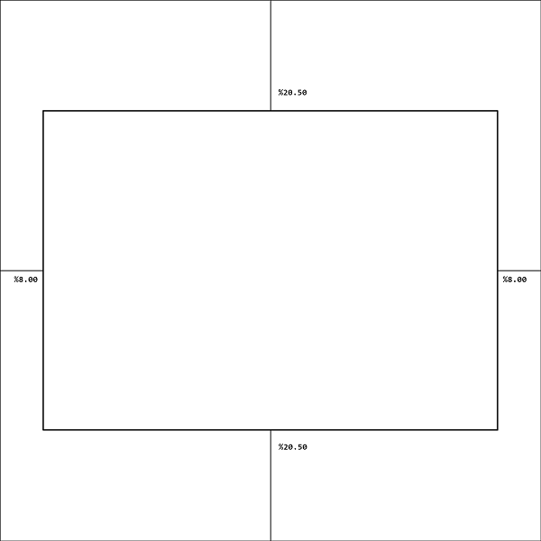
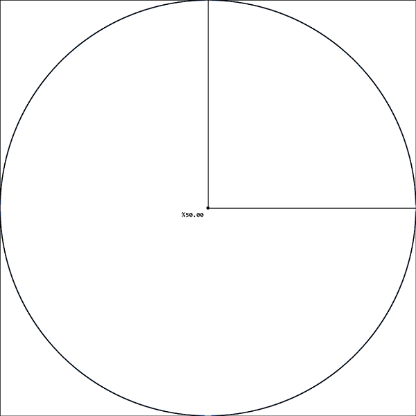
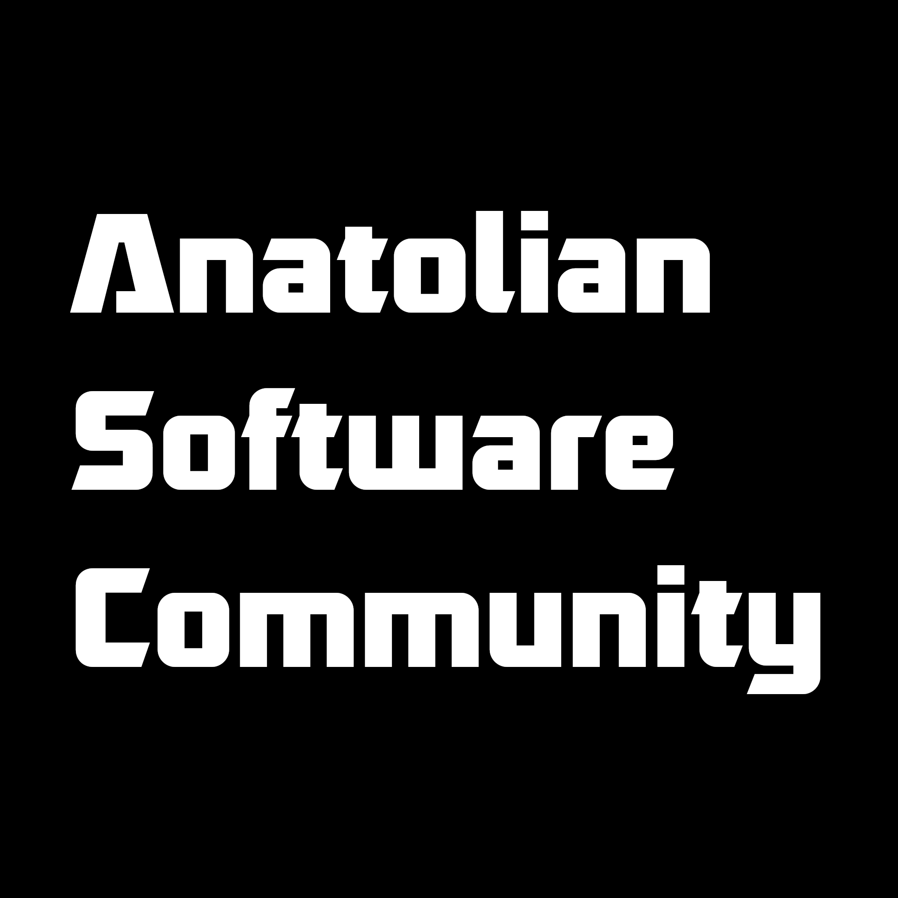
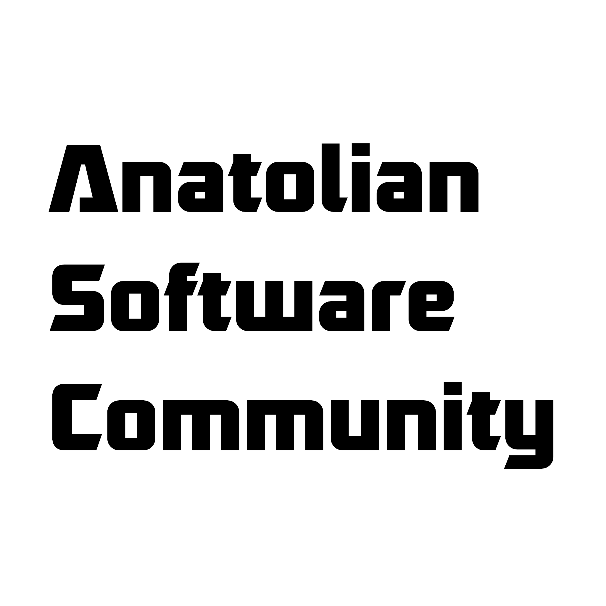

# Logo Usage Document

In this document can find how to use community logo.

## Boyut

The size of the community logo can be used as a square, the smallest 64 pixels and the largest 2048 pixels.

## Kenar Boşluğu ve Yerleşim

Community logo is used in a way that is centered inside the square. The logo is placed in the rectangle formed by leaving 20.50% space from the top and bottom edges and 8% from the right and left edges.

In addition, in order to use it on social media, the logo should fit in a circle that will fit perfectly inside the logo.

## Font and Colors

[Robofan by Cesar Puertas](https://www.dafont.com/robofan.font) has been chosen as the font for the community logo.

The logo has two alternative colors. RGB(0,0,0) is used for Black and RGB(255,255,255) is used for White. There is no additional use of the logo other than these uses.

## Contributors

- [Fatih Tatoğlu](https://github.com/fatihtatoglu)
- [Onur Menal](https://github.com/onurmenal)

## Documents

- [Black Logo](logo_final_black.png)
- [White Logo](logo_final_white.png)
- [Gimp File](logo_final.xcf)
