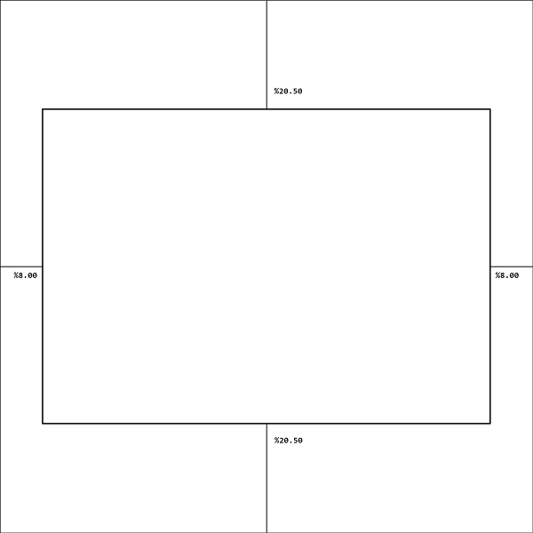
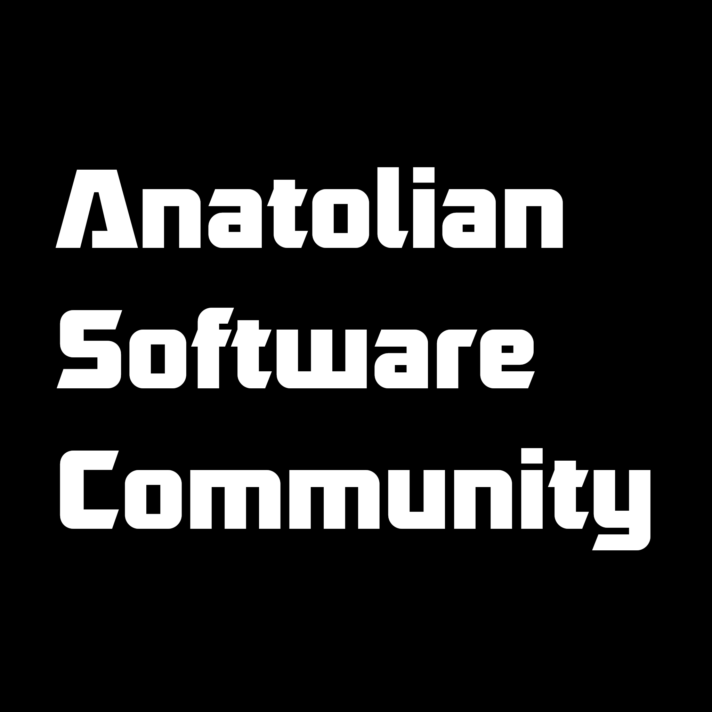
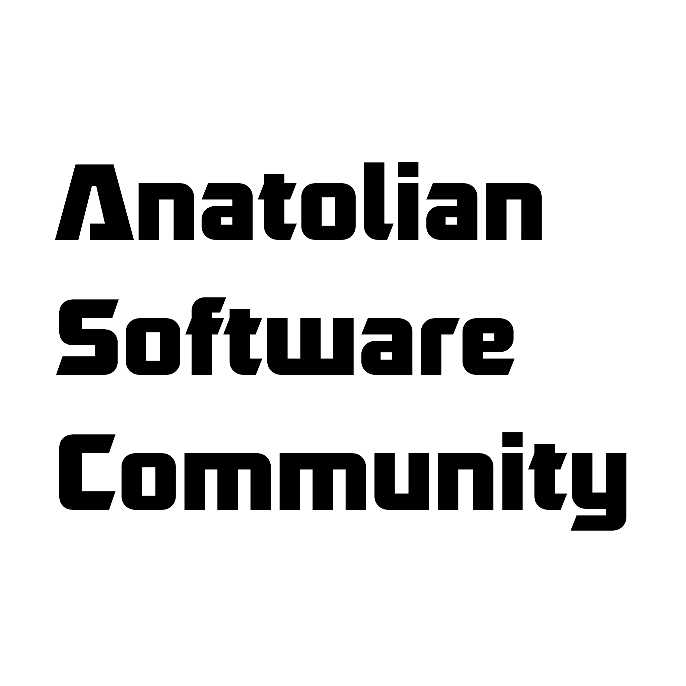

# Logo Kullanım Dokümanı

Bu doküman içerisinde topluluk logosunun nasıl kullanıldığı ile ilgili bilgileri bulacaksınız.

## Boyut

Topluluk logosunun boyutu kare olacak şekilde en küçük 64 pixel en büyük 2048 pixel olarak kullanılabilir.

## Kenar Boşluğu ve Yerleşim

Topluluk logosu bir karenin içerisine ortalanmış şekilde kullanılmakadır. Yukarı ve aşağı kenarlardan %20.50, sağ ve sol kenarlardan %8 boşluk bırakılarak oluşan dikdörtgen içerisine logo yerleşmektedir.

Ek olarak sosyal medya üzerinde de kullanmak için logonun içerisine tam olarak sığacak bir çember içerisine de logo sığmalıdır.

## Yazı Karakteri ve Renkler

Topluluk logosunun yazı karakteri olarak [Robofan by Cesar Puertas](https://www.dafont.com/robofan.font) seçilmiştir.

Logonun iki alternatif renklendirmesi bulunmaktadır. Siyah olarak RGB(0,0,0) ve Beyaz olarak RGB(255,255,255) kullanılmıştır. Bu kullanımlar dışında logonun ek bir kullanımı bulunmamaktadır.

## Katkıda Bulunanlar

- [Fatih Tatoğlu](https://github.com/fatihtatoglu)
- [Onur Menal](https://github.com/onurmenal)

## Dokümanlar

- [Siyah Logo](logo_final_black.png)
- [Beyaz Logo](logo_final_white.png)
- [Gimp Dosyası](logo_final.xcf)
